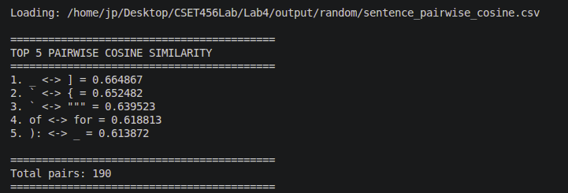
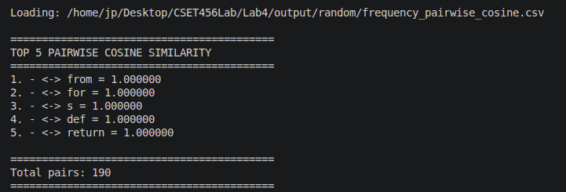
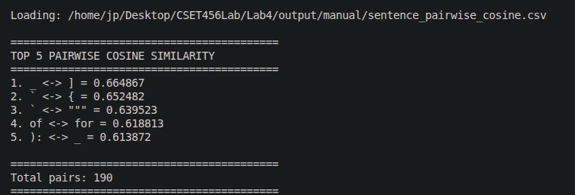
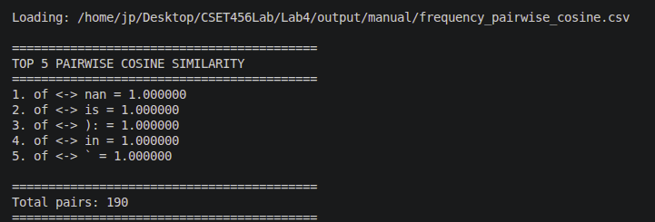

The 5 most similar pair for sentence(random)


```
1. _ ↔ ] : Not really. They have very different uses in code, so the high similarity is unexpected.

2. ` ↔ { : Somewhat reasonable since both are special characters, but they have different purposes.

3. ` ↔ """"""" : This makes some sense because both are related to quotation/special-character usage.

4. of ↔ for : This makes reasonable sense because both are common words and can appear in similar contexts.

5. ): ↔ _ : Not really. They serve completely different purposes in code.
```
for frequency(random)



for sentence(manual)



for frequency(manual)



i did the difference for the first one so we can move to the next part as the above part does the d section and e section of the 1st part 

(f) Representation failures:

1. _ and ] have a relatively high similarity of 0.6649 even though they have different roles in code.
2. ): and _ have a similarity of 0.6139 despite serving very different purposes.
These examples show that the embedding does not always capture the functional or semantic relationship between tokens.